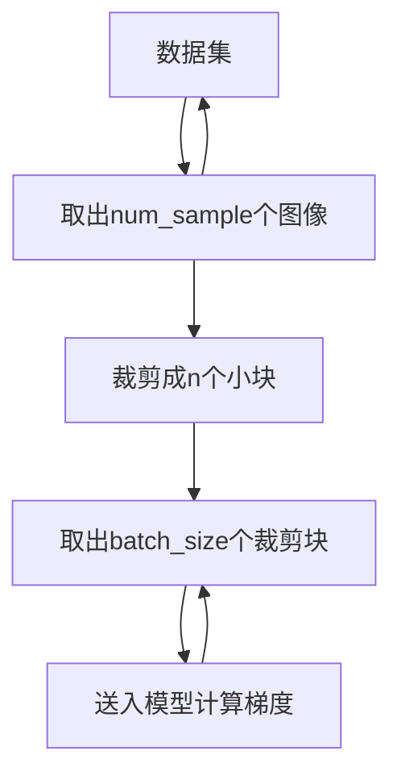

# 简单超分辨率模型

## 流程


## 文件结构

+ data 数据集
  + super_resolution 数据集名字
    + train 训练集
    + val 验证集
    + test 测试集
+ model 网络模型
+ backup 自动备份的模型
## 训练

```bash
python train.py
--dataset       数据集
--lr            学习率
--model         采用模型(SimpleSRCNN/ResNetCNN)
--patch_size    裁剪块大小
--patch_stride  裁剪块步幅
--num_epochs    训练次数
--num_res_blk   模型残差块数量,仅SRCNN模型生效
--kernel_size   卷积核大小,仅SRCNN模型生效
--minimum_scale 裁剪块最低分辨率比例
--maximum_scale 裁剪块最高分辨率比例
--num_image     训练所用图像数量
--num_sample    每批次下单次采样图像数量,数值越高越吃内存
--batch_size    每次训练所使用的裁剪块数量
--no_bp_train   不使用断点训练,若断点训练默认使用model.pth
--padding       卷积核扩充大小,仅SRCNN模型生效
--backup        自动备份模型,每次采取num_sample张图片train完之后保存一次
```
## 测试

```bash
python test.py
```
## 效果
### SimpleSRCNN


### ResNet
